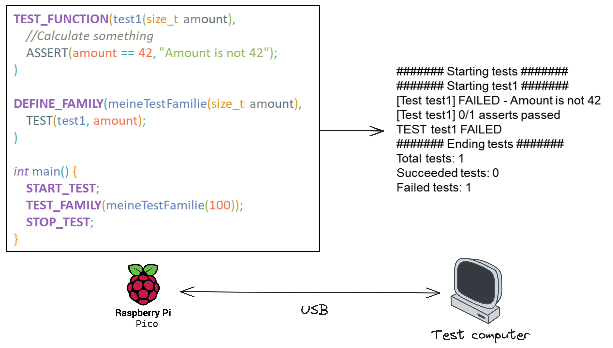

# Pico-Unit

Simple and lightweight Test-Framework for Raspberry Pi Pico



## Install

Pico Unit can be cloned from GitHub through this link:


The `pico-unit.h` header-file must then be included.

## Usage

The usage of Pico Unit is straightforward :

### 1. Create Tests

Use the `TEST_FUNCTION(<test name>(<parameters>))` Macro to create a test and use the `ASSERT(<condition>, <error to print>)` C-Macro to verify a test condition.

> [!NOTE]
> This example compares 42 with the amount given in parameter.

``` {.c .copy}
TEST_FUNCTION(test1(size_t amount),
    //Calculate something
    ASSERT(amount == 42, "Amount is not 42");
)
```

### 2. Create a test family

Use `DEFINE_FAMILY(<family name>(<parameters>))` to create a test family with multiple tests that will be called.

> [!NOTE]
> This examples calls the test `test1` declared in previous example and gives the variable 'amount' as parameter.

``` {.c .copy}
DEFINE_FAMILY(meineTestFamilie(size_t amount),
    TEST(test1, amount);
)
```

### 3. Start testing a test family

Use `TEST_FAMILY(<family to call>(<parameter values>))` to call a test family.

> [!NOTE]
> This example calls the test-family `meineTestFamilie` and gives 100 as parameter

``` {.c .copy}
int main() {
    START_TEST;
    TEST_FAMILY(meineTestFamilie(100));
    STOP_TEST;
}
```
